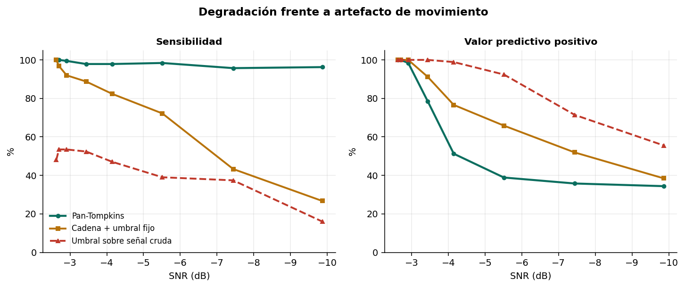
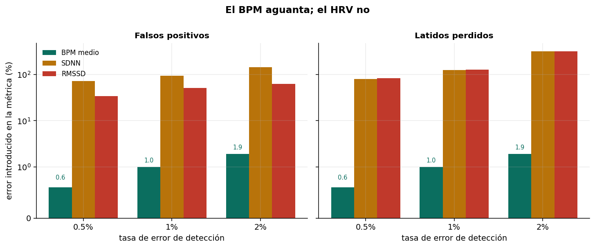

# ¿Qué tan bueno es realmente tu detector de QRS?

Evaluación del detector Pan-Tompkins: degradación frente a ruido, comparación con
detectores más simples, y el efecto de los errores de detección sobre las métricas que
alimenta.



## Resultado principal

**Un 1% de latidos perdidos mueve el BPM medio un 1% y el RMSSD un 128%.**

| Error introducido | BPM | SDNN | RMSSD |
|---|---|---|---|
| 1% falsos positivos | +1.0% | +94.5% | +51.4% |
| 1% latidos perdidos | −1.0% | +126.6% | **+128.7%** |
| 2% latidos perdidos | −1.9% | +317.6% | **+319.2%** |

El BPM medio promedia cientos de intervalos y diluye el error. El RMSSD eleva al cuadrado
las diferencias entre intervalos consecutivos, así que un solo intervalo del doble de
largo domina la suma.

Un detector con 99% de sensibilidad es excelente para reportar frecuencia cardiaca e
inservible para calcular HRV sin corrección posterior.



## El sesgo de Pan-Tompkins

A −10 dB de SNR con artefacto de movimiento:

| Detector | Sensibilidad | VPP |
|---|---|---|
| Pan-Tompkins | 96.3% | 34.4% |
| Cadena + umbral fijo | 26.7% | 38.5% |
| Umbral sobre señal cruda | 16.0% | 55.6% |

Pan-Tompkins no pierde latidos: los inventa. El search-back y el umbral adaptativo
introducen ese sesgo a propósito, y es el correcto para monitorización (no detectar una
asistolia es peor que una alarma de más). Para análisis de variabilidad juega en contra.

Nota metodológica: el ruido EMG (20–150 Hz) **no** estresa a este detector, porque el
paso-banda lo elimina. El ruido relevante es el artefacto de movimiento, dentro de 5–25 Hz.

## Ni la detección perfecta basta

Con extrasístoles ventriculares, el detector alcanza 100% de sensibilidad y 100% de VPP —
la regla de 360 ms no las descarta, porque su pendiente es comparable a la de un latido
normal. Aun así:

| Detección 100% correcta | BPM | SDNN | RMSSD |
|---|---|---|---|
| Con extrasístoles incluidas | 59.3 | 197.9 | 271.8 |
| Excluyendo latidos ectópicos | 63.2 | 87.0 | 119.0 |
| Diferencia | −6.2% | **+127.5%** | **+128.4%** |

El latido prematuro y su pausa compensadora no reflejan modulación autonómica, pero entran
en la cuenta. Detectar bien no basta: hay que decidir qué latidos cuentan.

## Evaluación contra datos reales

`src/mitbih.py` evalúa el detector contra registros anotados de MIT-BIH Arrhythmia. No se
ejecuta en el notebook porque requiere descargar los datos.

```bash
pip install wfdb
python src/mitbih.py
```

El artículo original reporta 99.3% de sensibilidad sobre esa base. Dos precauciones al
comparar: la tolerancia de emparejamiento cambia los números, y las anotaciones incluyen
símbolos que no son latidos (cambios de ritmo, marcas de ruido) que hay que filtrar antes
de contar.

## Contenido

```
notebooks/pan_tompkins_evaluacion.ipynb   Notebook completo, ejecutable sin datos externos
src/pantom.py                             Las cuatro transformaciones
src/detector.py                           Detector con heurísticas conmutables
src/rivales.py                            Detectores de comparación
src/escenarios.py                         Generación de señales
src/arritmia.py                           ECG con extrasístoles ventriculares
src/mitbih.py                             Evaluación contra PhysioNet (requiere wfdb)
figuras/                                  Figuras generadas
```

## Reproducir

```bash
git clone https://github.com/USUARIO/pan-tompkins-evaluacion.git
cd pan-tompkins-evaluacion
pip install -r requirements.txt
jupyter lab notebooks/pan_tompkins_evaluacion.ipynb
```

## Limitaciones

La señal es sintética: las comparaciones relativas entre detectores son más confiables que
las cifras absolutas.

El artefacto de movimiento está modelado como ruido de banda; el real es más estructurado
(escalones por despegue de electrodo, transitorios con forma de QRS).

Solo se modela un tipo de arritmia. La fibrilación auricular rompe supuestos distintos: el
search-back espera un RR medio estable.

No se mide consumo ni latencia, restricciones centrales del diseño original.

## Referencias

- Pan J., Tompkins W. *A Real-Time QRS Detection Algorithm.* IEEE Trans. Biomed. Eng., 1985.
- Task Force of the ESC and NASPE. *Heart rate variability: standards of measurement, physiological interpretation, and clinical use.* Circulation, 1996.
- Moody G., Mark R. *The impact of the MIT-BIH Arrhythmia Database.* IEEE Eng. Med. Biol., 2001.

## Licencia

MIT — ver [LICENSE](LICENSE).
